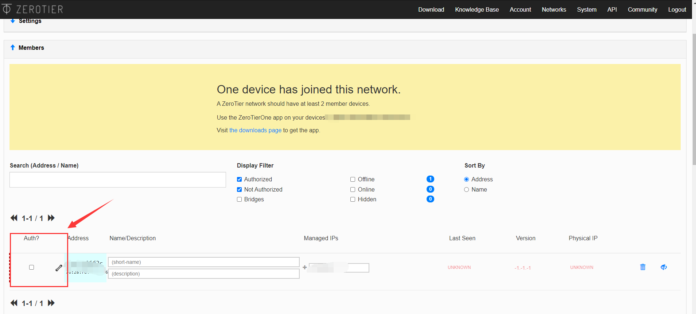

# ZeroTier

官方介绍:

>   ZeroTier transforms the entire world into a single data center or cloud region. Network all your devices, virtual machines, and applications like they’re all plugged into the same switch.

翻译一下:

>   ZeroTier将整个世界转变为单个数据中心或云区域。 将所有设备，虚拟机和应用程序联接起来，就像在同一个交换机接入所有设备一样。

简单来说, 它就是一个VLAN组建工具, 不过与一般的组建VLAN的工具(如Hamachi, n2n等)不同, ZeroTier有这么几个优势:

-   **几乎零配置**: 传统的VLAN组建工具一般都需要自建超级结点(如n2n的supernode), 需要在一台有公网ip的服务器上进行一系列的配置, 整体来说对新手比较劝退.
-   **可以固定自定义ip**: 这一点相对于Hamachi, 通过自建的网络, 我们可以自定义一个固定的ip, 你可以, 用192.168.1.1来访问云服务器1, 用192.168.1.2来访问云服务器2, 方便记忆, 而不是像Hamachi一样生成类似5.233.212.45这样的随机ip.
-   **跨平台**: ZeroTier提供了windows, macOS, linux, Android, iOS...几乎全平台的客户端, 你可以把任意平台的设备接入VLAN.

*注: 本文所指的VLAN的建立都是指在ZeroTier官方的Earth网络下建立的VLAN, 还有另外一种自建Moon网络服务器的一种策略, 关于两种网络策略的功能差异本文不做赘述, 有兴趣的小伙伴可以自行查阅ZeroTier的官网. （Moon网络服务器的配置已经更新在下方）*

介绍完毕, 正式开始讲解如何进行相关配置:

ZeroTier的VLAN配置包括两个部分, **Network配置**和**Client配置**, 前者可以理解成VLAN的路由器配置, 配置原理大概就类似于配置家用路由器.

## 使用步骤：

1、进入官网

官网：https://www.zerotier.com/

2、进入官网登录注册

3、新建虚拟局域网


4、保存自己的 Network ID

5、手机端下载好 Zerotier 以后， 新建网络，添加刚才的网络 ID，设置运行蜂窝数据，允许启动

6、PC端在官网下载客户端并安装


安装完成后会自动启动，任务栏可以看到

右键点击 Open Control Panel 可打开客户端

在下方红色窗口输入网络 ID 加入网络


7、Ubuntu 安装  Zerotier

```bash
sudo apt-get update ; sudo apt-get install curl ; curl -s https://install.zerotier.com | sudo bash
```

添加网络ID

```bash
sudo zerotier-cli join 网络ID
```

8、最后在 ZeroTier Web 端（网页端）在刚才那个虚拟局域网中的Member设置中，把要加入的设备在下图中打勾，运行进入局域网



9、之后公网设备输入电脑的 虚拟IP 加端口号即可连接设备

## 网络基本配置

此处参考知乎用户 @Lulus


## Moon 服务器搭建过程

由于 Zerotier 的中转服务器在境外，导致直连延迟和丢包都比较高，所以可以采用 ZeroTier 官网中的 Moon 服务器搭建过程，把自己带有公网IP的服务器作为中转服务器，进行转发，达到降低延迟的效果。

1、购买云服务器（此处我采用的是 腾讯云服务器，对linux服务器操作生疏的小白建议学习下linux系统基础）

2、敲入下列命令按照 ZeroTier

```bash
curl -s https://install.zerotier.com/  sudo bash
# 如果安装失败，多输入几遍即可安装成功，是因为网络问题可能导致安装包下载失败
```

3、加入上面创建的虚拟局域网

```bash
zerotier-cli join 网络ID
```

加入之后记得在网页端通过验证

4、生成 moon.json 模板

```bash
# 只有安装成功后才有这个目录
cd /var/lib/zerotier-one
zerotier-idtool initmoon identity.public > moon.json 
```


5、修改 moon.json 在 `stableEndpoints` 处 如下列格式添加自己的公网IP，端口号必须为9993，这是zerotier的端口号

```bash
{
 "id": "e2b252dsff",
 "objtype": "world",
 "roots": [
  {
   "identity": "e2b252d5d7:0:1fc79095544b4951aab8078c10b9882e21c9fcf438b7b43ca546fb9da7a6e34e437d1c2b044d111c77dffcea85cee14085b5919d0532e062ae0b5764db27058d",
   "stableEndpoints": ["1.2.3.4/9993"]
  }
 ],
 "signingKey": "c317db708ac2acae01746ab4d3acc224edfhghge16eae9gfgadfh9cc1e847307fd1da8317289hghgdca6594349aae50016481cdacb0c29c2c56e00345de0a11b1e9fafce767897b",
 "signingKey_SECRET": "03fb533be8cc5acb4f873d5182a0b0b5bgfgd4d8cbe7fa811e18a5295749c0cd94gfgf51685d5d67c78b4e07a552f6172a5265093e44849c19710ab73dc9c03a4b731ac5",
 "updatesMustBeSignedBy": "c317db708ac2acae01746ab4dgf3acc224edfe16eagfdgfe99cc1e847307fd1da8317289dca6594349aae50016481cdacb0c29c2c56e00345de0a11b1e9fafce767897b",
 "worldType": "moon"
}

```

6、记住上面 moon.json文件中的 id：`e2b252dsff`

7、生成加密签名文件

```bash
zerotier-idtool genmoon moon.json 
```

在 Zerotier 安装目录下（/var/lib/zerotier-one）建立文件夹 moons.d，将生成的 .moon文件拷贝进去。
重启 zerotier，**重启电脑**。至此，VPS 上（moon 服务器）配置完成。

8、最后一步，服务端配置后，我们需要在每台客户端配置一个Moon服务器文件（感觉这部非常繁琐及可以完全由ZeroTirer下发，不知道为何要这样做。），配置客户端，输入指令

```bash
zerotier-cli orbit <id> <id>
```


这里一般会出现一个文件权限问题，报错 显示 **authtoken.secret not found or readable in C:\ProgramData\ZeroTier\One (try again as root)**

解决方式参考这篇博客：https://blog.csdn.net/qq_39518314/article/details/119979511

亲测可以解决

再输入下列指令检查是否找到Moon服务器

```bash
zerotier-cli listpeers 
```


出现如上图结果，说明配置成功，且连接成功

## 我自己遇到的BUG

在输入指令 `zerotier-cli listpeers` 后 虽然能看到Moon服务器，但是发现 服务器的公网IP为  `- -l ` 说明此客户端并没有连上Moon服务器，而且发现并没有降低ping的延迟

可能原因有两个节点若能直连可能不会走中转，或许需要强制中转

在经过debug后发现，zerotier是通过UDP进行转发的，所以需要在自己的服务器安全组中开放 UDP 9993 的端口，即zerotier的端口，


可以看到与上图相比，此图已经出现公网 IP


此时不再到境外的服务器进行转发，而是通过我的Moon服务器进行转发，成功解决！

通过上面的步骤，现在已经可以和hxd一起愉快的联机了！